# Fighting the Filter Bubble - Anti-recommendation Engine for Arguments

<p align="center">

</p>

Digitalization has lead to very personalized content and with it filter bubbles are formed. Es-
caping the bubble is hard because filter bubbles make it more difficult to access information
outside of already established knowledge and interests. To counter this we try to find arguments
with a different stance towards a topic and offer the option to an informed view in that matter.

## Bachelor Thesis Lucas Brunner ([www.bru.lu](https://www.bru.lu))

We present the ProCon Dataset, a new argument pair dataset helping to combat the filter bubble. The dataset is composed of 35’000+ samples consisting of one question, two arguments and a label denoting if both arguments argue for the same side of the question or not. It is based on arguments from [ProCon.org](https://procon.org). The dataset gets automatically generated when runnin this repo and is available on [Github](https://github.com/Sertingolix/procon-dataset) as well. Instead of fighting the filter bubble by proposing articles or arguments with opposing views we focus on the underlying task detecting if two arguments talk about the same topic but from a different side. Unlike other systems like [IBM Debater](https://www.research.ibm.com/artificial-intelligence/project-debater/index.html) we try solving this task only with pairs of articles instead of using a precomputed data structure storing information about topics. By only focusing on text features transferring a trained model to new topics is more likely to work because knowledge about the topic is not necessary. We describe multiple candidate models for solving this task leading to a baseline model with a validation accuracy of 65%. Human performance although is around 25% higher making the ProCon Dataset a challenging task for future research.

## Usage Instructions
 
This repo cotnains the BERT Model used in the thesis "Fighting the Filter Bubble". Executing `bash startup.sh` installs Tensorflow GPU and other dependencies in a python enviroment. The system and software requirements for Tensorflow GPU can be found on `https://www.tensorflow.org/install/gpu`. `bash run.sh` executes BERT with default settings. If no pretrained BERT model is submitted (`--bert_dir path/to/BERT/`) the script will download the lates recomended BERT Base model (currently `multi_cased_L-12_H-768_A-12`). Similarly, if no dataset is submitted (`--input_dir path/to/dataset/folder`), the script will download/crawl the ProCon dataset (`https://github.com/Sertingolix/procon-dataset`). Those downloads are only executed once. Note that crawling the ProCon dataset takes ~5-10 minutes. A whole list of all suported settings can be accesed by executing `bash run.sh --h`.

### TL;DR
Install dependencies to run BERT in a python enviroment with:

```
bash startup.sh
```

Run BERT with default setting:

```
bash run.sh
```

To show all options use:

```
bash run.sh --h
```

## BERT Model
BERT which stands for Bidirectional Encoder Representations from Transformers is designed to pre-train deep bidirectional representations from unlabeled text. The model is pre-trained with a large text corpus and finetuned for a specific task afterwards. When published in 2018 its result became state of the art in many natural language processing tasks. The pre-trained model is publicly available on [Github](https://github.com/google-research/bert). BERT uses a word piece model [WSC + 16]. That means input text is split not only by words but also by sub-words. The sequence of word pieces added with special tokens, like the '[SEP]' telling the model that a input sequence is finished, are the input to the model. In the model every word piece is replaced with an embedding and given to the transformer.

### BERT Default

<p align="center">
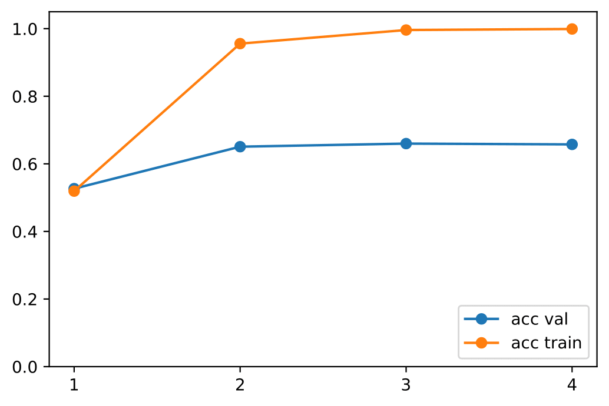
</p>

In the default configuration, the BERT Model outperforms other alternative models we tried by a great margin. BERT training performance with a max sequence length of 384 over 4 epochs can be found in the figure above. The plot shows the model overfitting to the training set (training accuracy reaches 100%). The next few sections are experiments to evaluate how different model parameters affect model performance and the problem of overfitting. For briefness only some results are shown in the following sections. We believe the main problem of overfitting can be attested to the model having difficulties handling long input text. Only using the shorter inputs increases model performence but is impractical as this would revent the model from predicting most samples found in other sources. For feature work, we think most gains in this task can be gained be handling longer input sequences better or by using even more powerfull language models.

### Influence Dropout

<p align="center">
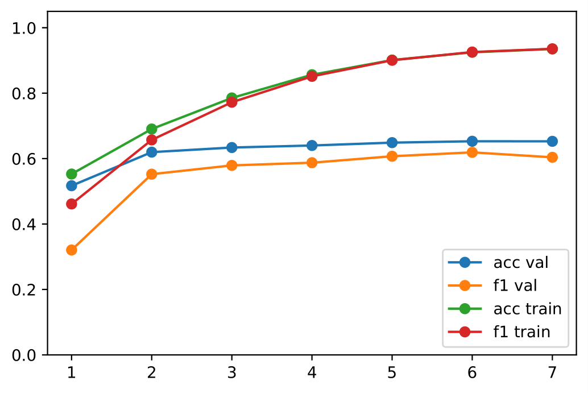
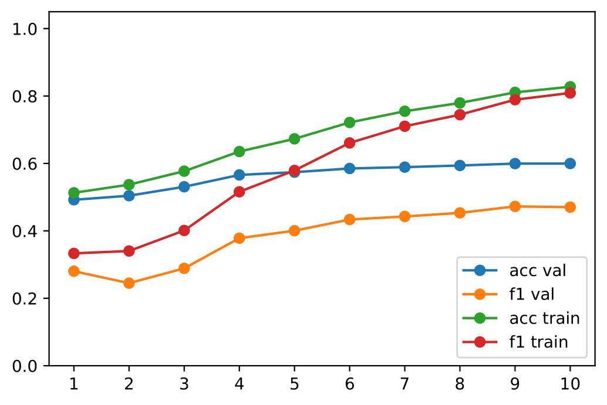
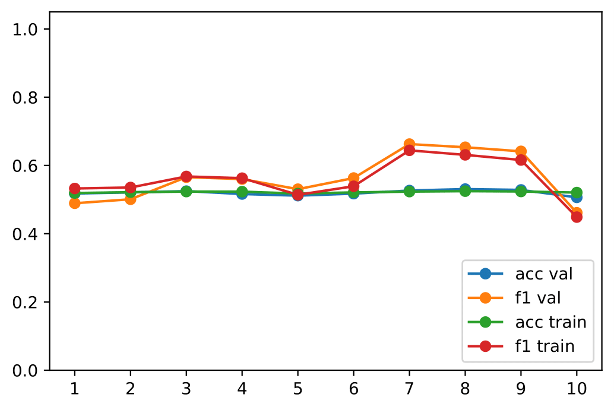
</p>

The BERT default model overfits to the training data (training accuracy 100%). Ideally both training and validation accuracy are high and at a similar level. To prevent overfitting many methods like early stopping, regularizing weights with Lasso and Ridge regression or adding dropout are known. The BERT default model already uses dropout on the attention mechanism as well as on hidden states. Both are by default set at a 10% dropout rate and both are incremented equally in this experiment. Model performance with a learning rate of 2e−6 for dropouts 0.3, 0.4 and 0.5 can be found in the figures above. It is visible, that learning with a dropout rate of 0.3 is still possible although convergence is slow. For dropout 0.4 validation scores are stuck and for dropout 0.5 learning is impossible. It appears as if the validation accuracy is bounded around 60%-65%.

### Human Performance

<p align="center">
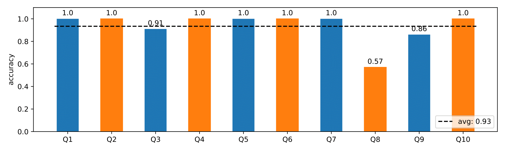
</p>

To see how well a human can perform in deciding if two articles argue for the same side we classified a subset of sample by hand. The setup consists of a part of the ProCon dataset consisting only of both argument bodies (the question is not visible). Based on both argument bodies participants have to classify if both arguments argue for the same side. To prevent fatigue blocks of 5 samples are labeled at a time. Contestants can label at most 2 blocks (10 samples) and in total over 25 blocks with human labels are generated. Because only a small subset of all samples in the ProCon dataset are labeled human performance can deviate from the experimental results. In the majority of samples all raters agree on the label and label most of the samples correctly. In around 10% of samples raters do not agree on a clear label. Because the accuracy achieved on the small subset is above 93% we assume human performance to not be below 90% on the whole ProCon Dataset. While classifying we noticed asking ourselves what the question might be over and over again. This could mean that the task of deciding if two bodies argue for the same side or not could benefit from creativity or a broad knowledge. Multiple participants also commented on having thought of a different question after the actual label from ProCon is revealed. The figure above shows
the human accuracy for a subset of 10 samples. Only Q8 shows a great disagreement between
participants. In 70% of samples the human vote is unanimous.

### Learning with Questions

The human performance shows that the task can be solved with greater accuracy. As noted before knowledge or creativity about the question might be very useful. To test if the knowledge about the question also helps the model we make en experiment predicting the classes first with both arguments and the question and in a second step only both arguments. Because the BERT model uses at most two inputs we need to change the setup. Instead of predicting directly the classes we train first if an argument argues for the pro or con side and in a second step map two predictions (because there are two arguments) to a single prediction classifying if both articles argue for the same side or not. This first step can be learned with both the question and an argument as well as only with one argument. The mapping of the first two predictions to the final prediction is explained next in more detail.

For the classification in the second step two probabilities (for pro or con) for each argument are given and the output is the probability of both articles agreeing. As soon as the side of one article is undecided (50%) the probability for both articles agreeing/disagreeing should be 50% as well. Similarly, if both articles argue for the pro side the output should be agree. An evaluation for this mapping is shown in the next figure. The x,y axis corresponds to the probability the first (or second) argument is classified 'pro' and the resulting color is the prediction, that both arguments agree on the side.

<p align="center">
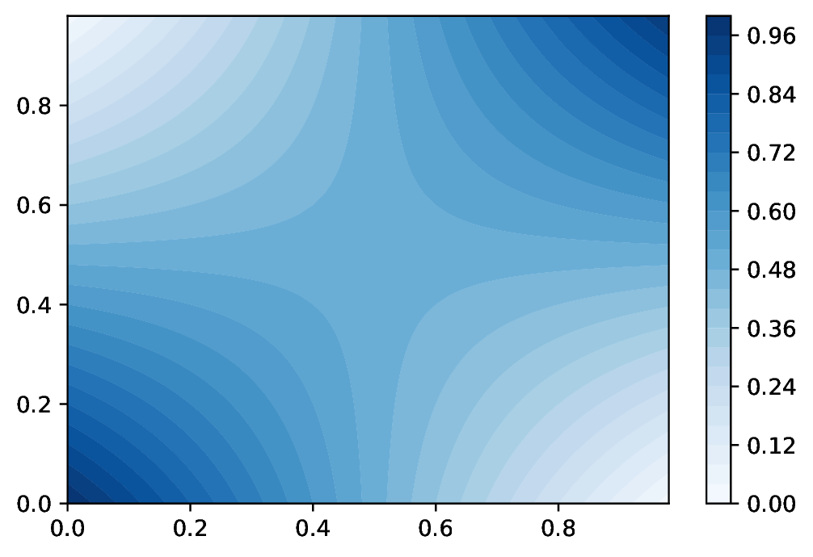
</p>

In a first step, BERT is used to learn the question-argument dataset. The performance over 5 epochs and a learning rate of 2e − 5 are shown. The highest validation accuracy is obtained in epoch 2 with an accuracy score of 69%.

<p align="center">
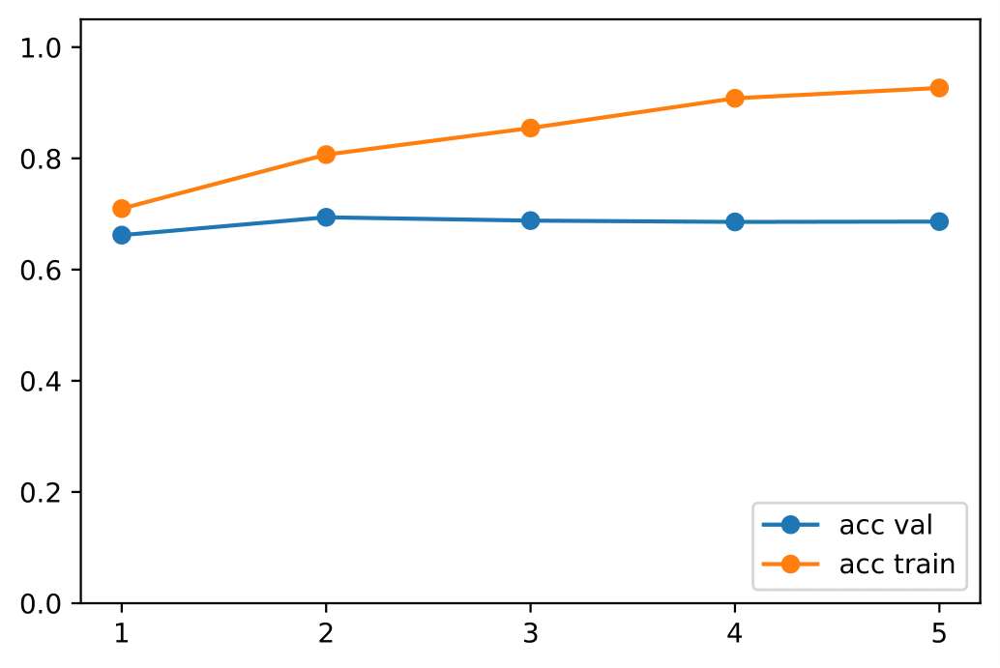
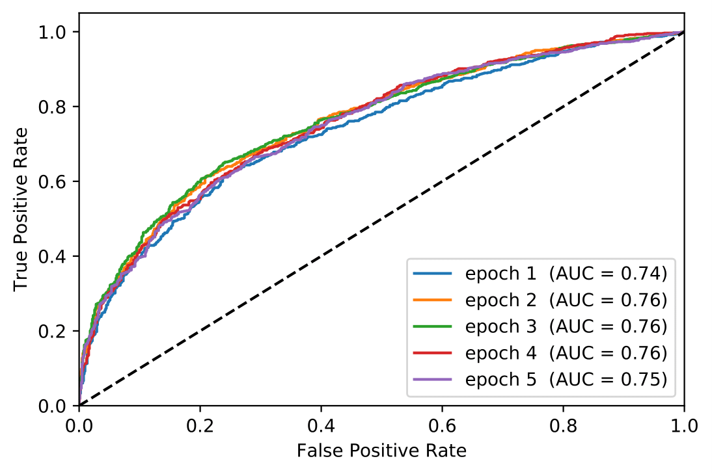
</p>

In a second step, the ProCon dataset consisting of argument1, argument2 and question, each sample is split up into two samples consisting of question and argument. Predicting those samples and mapping the probabilities results in the performance shown below. Surprisingly the accuracy is substantially lower than the accuracy of each question-argument pair.

<p align="center">
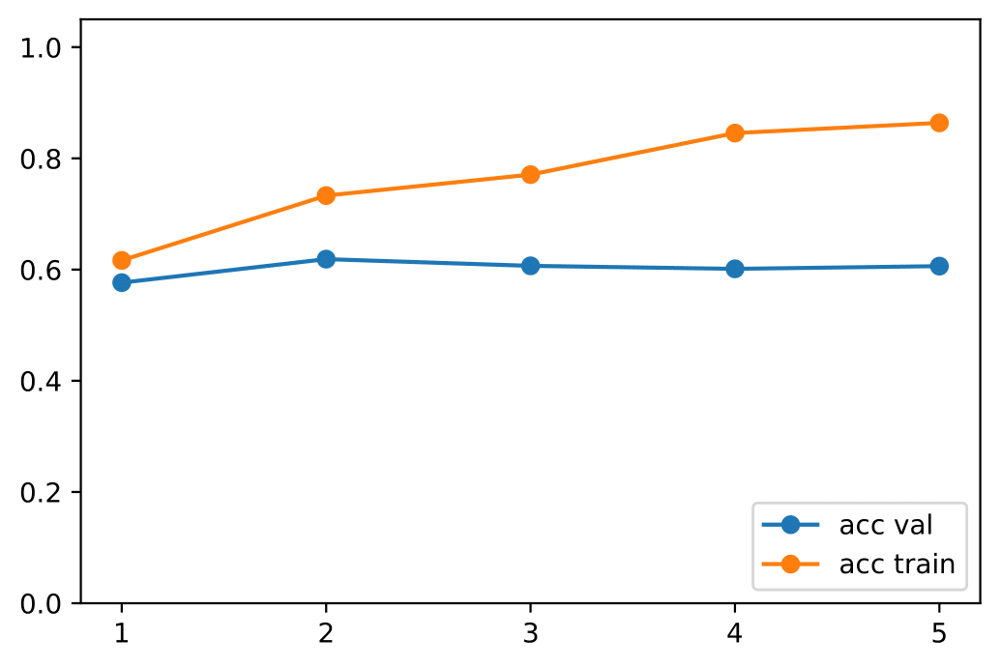
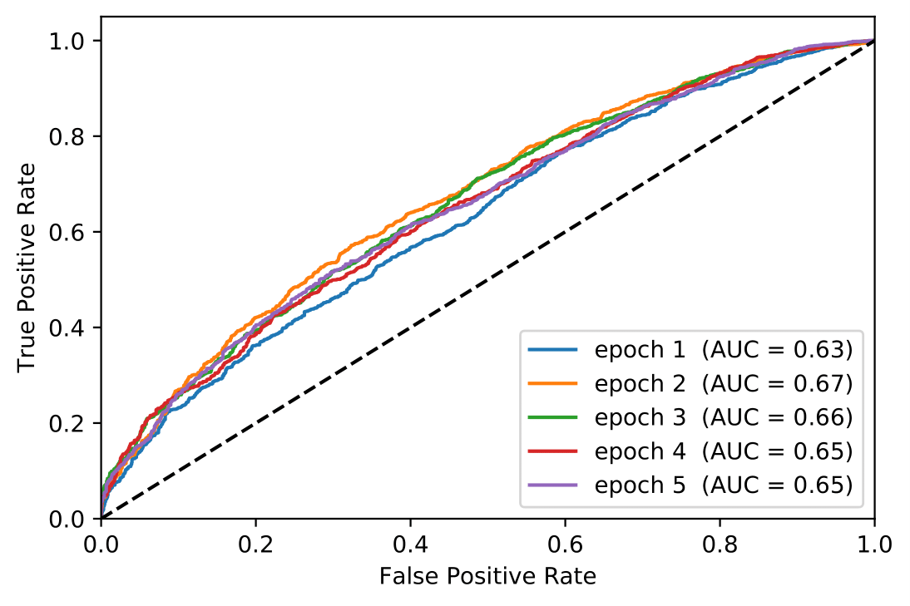
</p>

The BERT Model can be used with single inputs as well. Following the same model parameters as in the experiment with the question, but train and predict without taking the question into account therefore predicting the side of an argument solely by the argument itself. 

<p align="center">
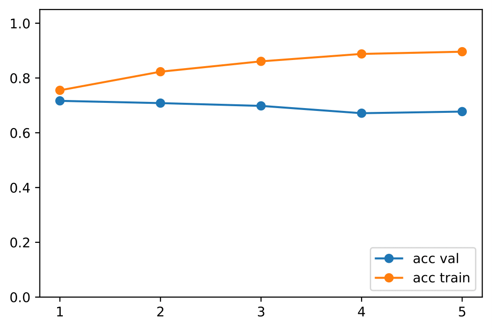
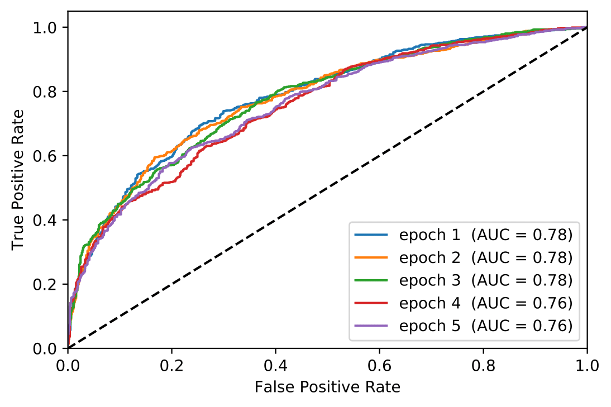
</p>

The highest validation accuracy obtained in the first step is 72%w. After the mapping the accuracy drops again and is at its best at 62%.

<p align="center">
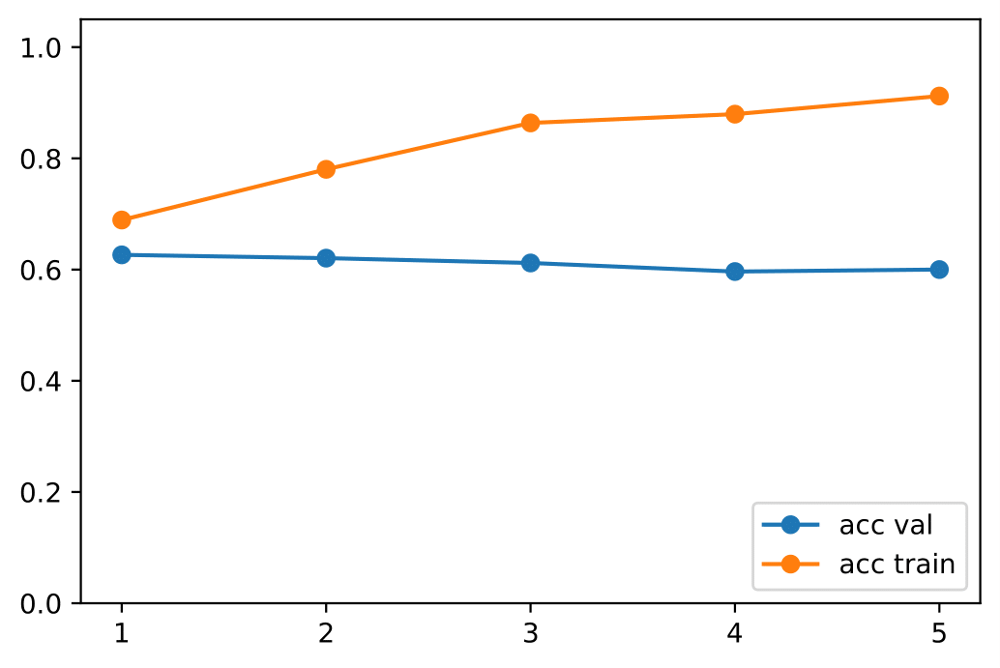
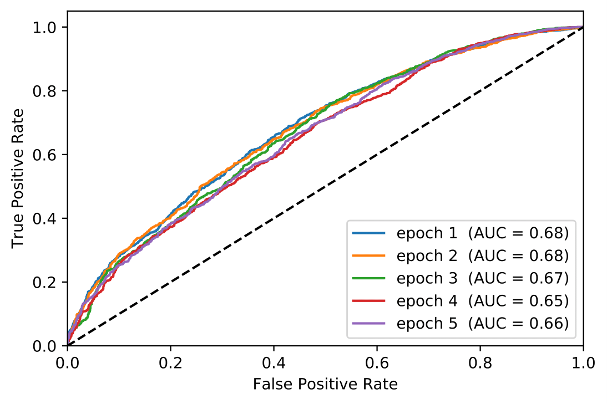
</p>

## Credits

Special thanks go to my advisors and the Media Technology Center at ETH Zürich ([MTC](https://mtc.ethz.ch)) with whom this work would not have been possible.

The BERT code is based on https://github.com/google-research/bert and adjusted to our requirements. The only file edited in the bert folder is run_classifier.py

